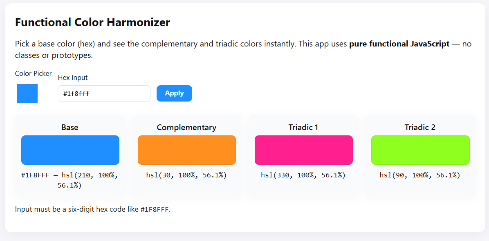

# Functional_Color_Harmonizer
A single-page JavaScript web app that dynamically calculates and displays color harmonies — including complementary and triadic colors — for any base color selected by the user.
<h1 align="center">🎨 Functional Color Harmonizer</h1>

A <b>functional JavaScript</b> color harmony generator that calculates <b>complementary</b> and <b>triadic</b> colors instantly.

---

<h2>🚀 Features</h2>

<ul>
  <li>Real-time color harmony visualization</li>
  <li>Purely functional JavaScript (no classes or prototypes)</li>
  <li>Converts HEX → HSL → CSS color format</li>
  <li>Automatic DOM synchronization</li>
</ul>

---

<h2>🧩 Core Functions</h2>

<table>
  <tr><th>Function</th><th>Description</th></tr>
  <tr><td><code>hexToHsl(hex)</code></td><td>Converts HEX to HSL</td></tr>
  <tr><td><code>calculateHarmonies(baseHsl)</code></td><td>Computes complementary + triadic colors</td></tr>
  <tr><td><code>hslToCss(hsl)</code></td><td>Formats HSL into CSS-compatible string</td></tr>
  <tr><td><code>updateColors()</code></td><td>Updates the DOM with calculated colors</td></tr>
</table>

---

<h2>📂 File Structure</h2>

<pre>
index.html
style.css
script.js
</pre>

---

<h2>📸 Preview</h2>

  

